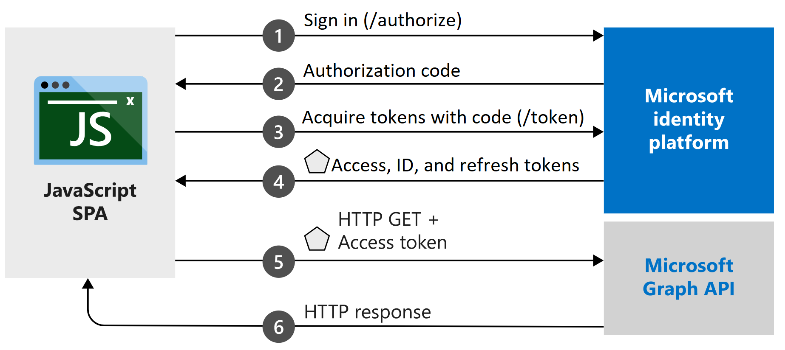

## FDA Portal

artifact id: fdaportal

---
technologies:
- reactjs
- html
- msal4j
products:
- azure-active-directory
- microsoft graph

description: "FDA Web Portal. React application that Uses MSAL authentication and 
client-side rendering to control the authentication flow of users, the authentication 
process happens on the client side of the application. Business logic to be added later on."

## FDA Portal Features

This beta contains the following MSAL React functionallity:

* Configuration
* Login
* Logout
* Conditionally rendering components for authenticated or unauthenticated users
* Acquiring an access token and calling Microsoft Graph

**Important:** MSAL with React supports the authorization code flow in the browser and PKCE enabled instead of the implicit grant flow. MSAL React does NOT support the implicit flow.

**Note:** This app was bootstrapped using [Create React App](https://github.com/facebook/create-react-app).

## Getting Started

### Prerequisites

[Node.js](https://nodejs.org/en/) must be installed to run this app.

### Setup

1. [Register a new application](https://docs.microsoft.com/azure/active-directory/develop/scenario-spa-app-registration) in the [Azure Portal](https://portal.azure.com). Ensure that the application is enabled for the [authorization code flow with PKCE](https://docs.microsoft.com/azure/active-directory/develop/v2-oauth2-auth-code-flow). This will require that you redirect URI configured in the portal is of type `SPA`.
1. Clone this repository `git clone https://git.web.boeing.com/fda/fes-user-management.git`
1. Open the [/src/authConfig.js](./src/authConfig.js) file and provide the required configuration values.
1. On the command line, navigate to the root of the repository, and run `npm install` to install the project dependencies via npm.

## Running FDA Portal

1. Configure authentication and authorization parameters:
   1. Open `src/authConfig.js`
   2. Replace the string `"Enter_the_Application_Id_Here"` with your app/client ID on AAD Portal.
   3. Replace the string `"Enter_the_Cloud_Instance_Id_HereEnter_the_Tenant_Info_Here"` with `"https://login.microsoftonline.com/common/"` (*note*: This is for multi-tenant applications located on the global Azure cloud. For more information, see the [documentation](https://docs.microsoft.com/azure/active-directory/develop/quickstart-v2-javascript-auth-code)).
   4. Replace the string `"Enter_the_Redirect_Uri_Here"` with the redirect uri you setup on AAD Portal.
2. Configure the parameters for calling MS Graph API:
   2. Replace the string `"Enter_the_Graph_Endpoint_Herev1.0/me"` with `"https://graph.microsoft.com/v1.0/me"` (*note*: This is for MS Graph instance located on the global Azure cloud. For more information, see the [documentation](https://docs.microsoft.com/en-us/graph/deployments))
3. To start the FDA portal application, run `npm install` once and then `npm start`.
4. Finally, open a browser and navigate to [http://localhost:3000](http://localhost:3000).

